# DineFlow

Self-hosted multi-tenant QR table ordering, kitchen display (KDS), and floor operations.
Served from Docker behind **Nginx**, exposed publicly via **ngrok**.

## Glimpse

Screenshots live in [`DineFlow/`](./DineFlow). The product is a live restaurant floor, not a generic dashboard.

### Staff login

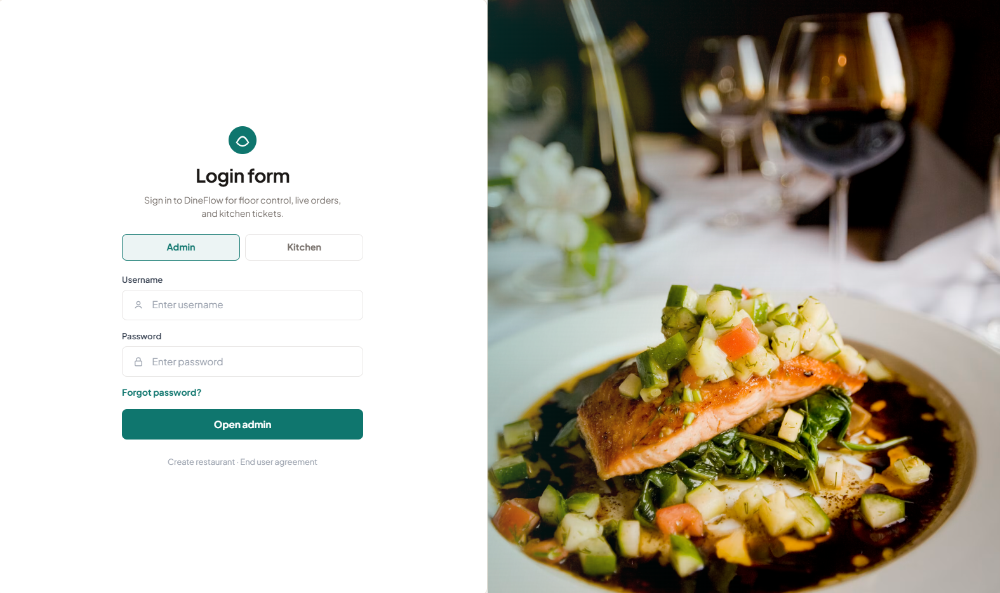

Split-screen sign-in for **Admin** or **Kitchen** workspaces.

### Live floor

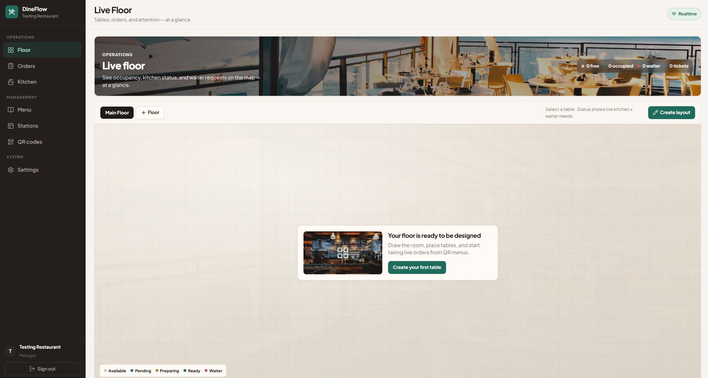

The floor is the primary workspace: occupancy, kitchen status, and waiter requests at a glance.

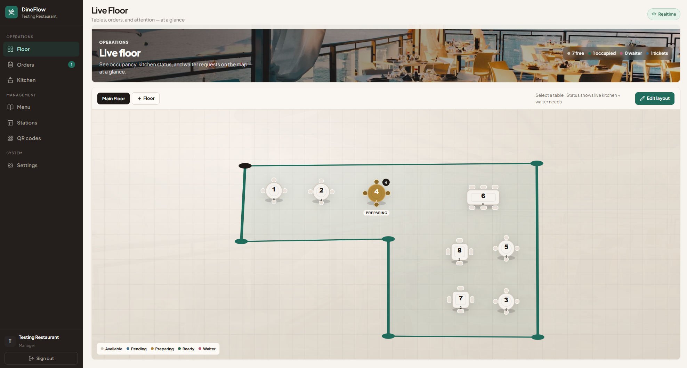

Tables use shape, color, label, and capacity together (available, occupied, pending, preparing, ready, waiter).

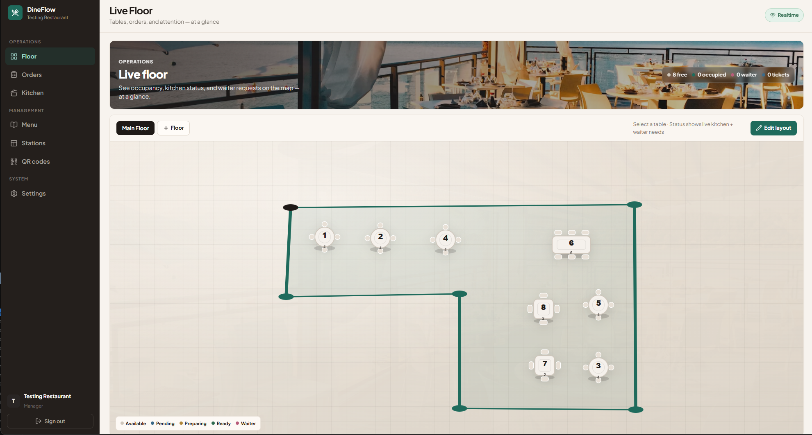

Layout editor: draw the room, place tables, cycle shapes, and save.

### Active orders

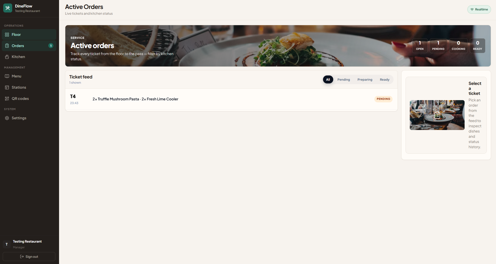

Ticket feed with status filters, dish lines, and audit trail.

### Menu

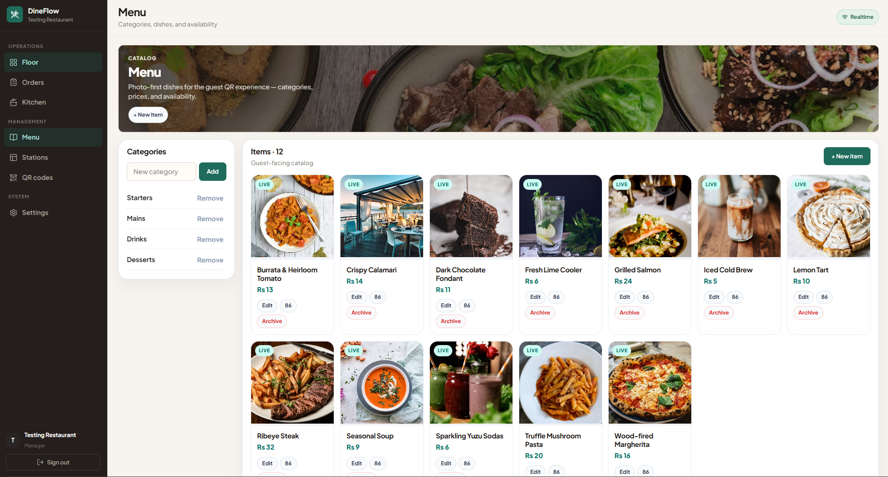

Photo-first catalog: categories, prices, availability, and kitchen station routing.

### Kitchen display

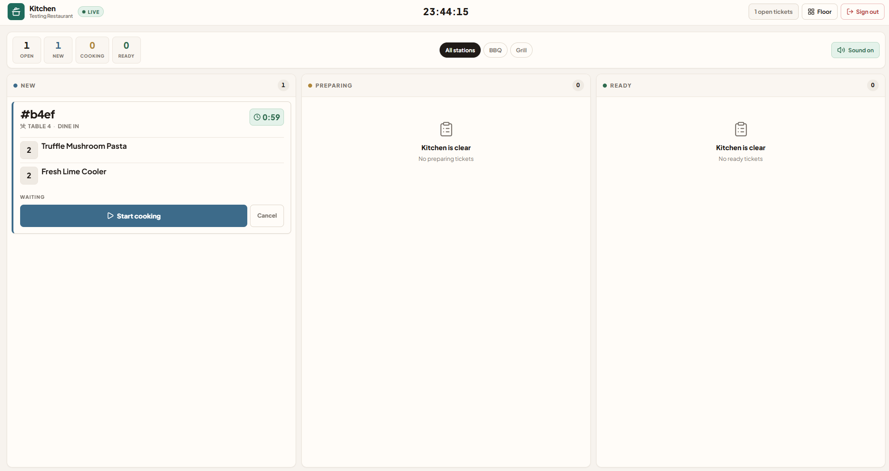

KDS lanes — **New → Preparing → Ready** — with large timers and bump buttons.

### QR codes & stations

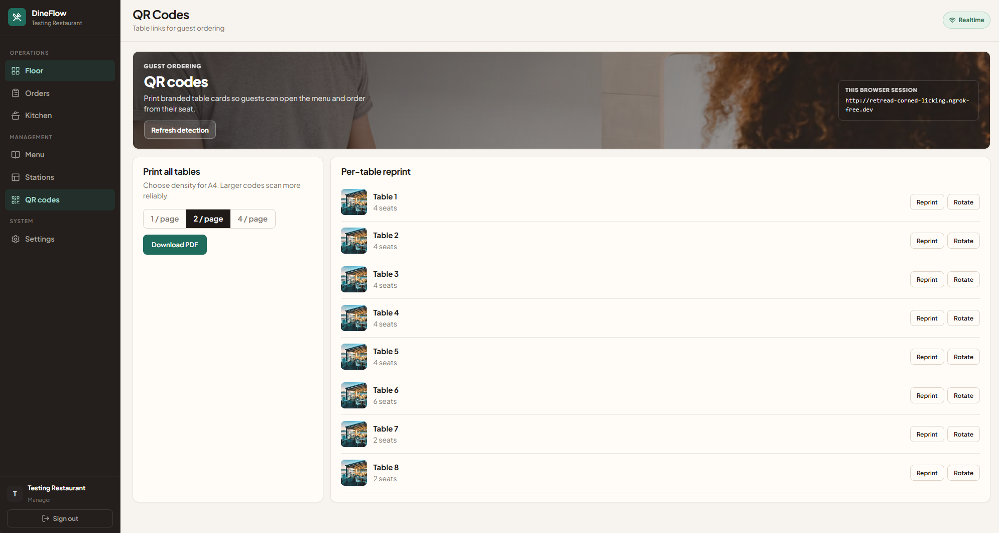

Print branded table cards (1 / 2 / 4 per A4) and reprint or rotate a single table.

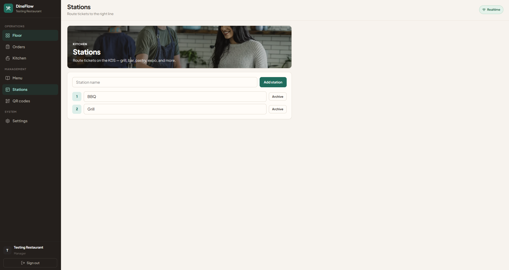

Route tickets to grill, bar, pastry, expo, and other lines.

### Settings

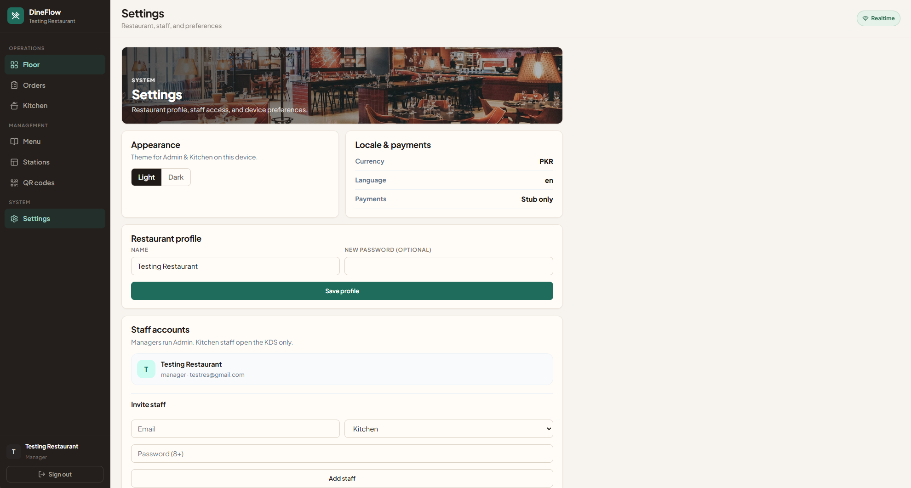

Restaurant profile, theme, locale, and staff accounts.

### Guest menu (QR)

Guests scan a table QR and order from their phone.

| Menu | Dish detail |
| --- | --- |
| 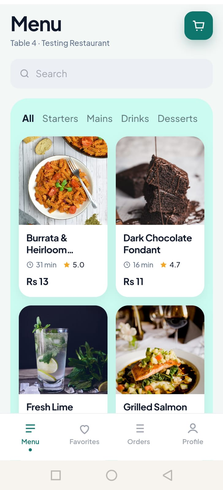 | 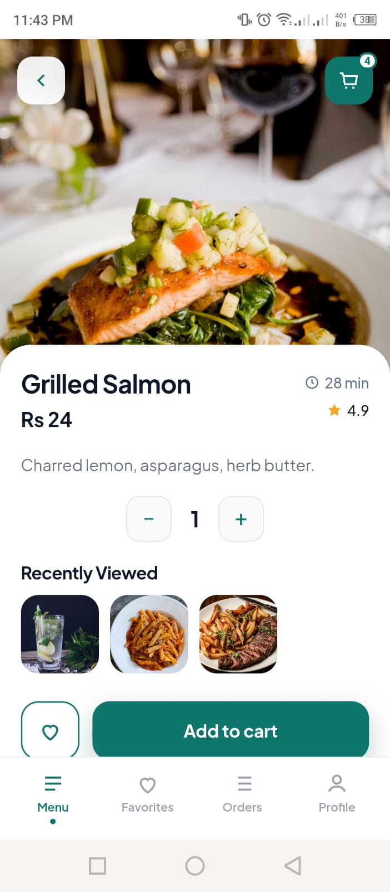 |

| Favorites | Your orders | Call waiter |
| --- | --- | --- |
| 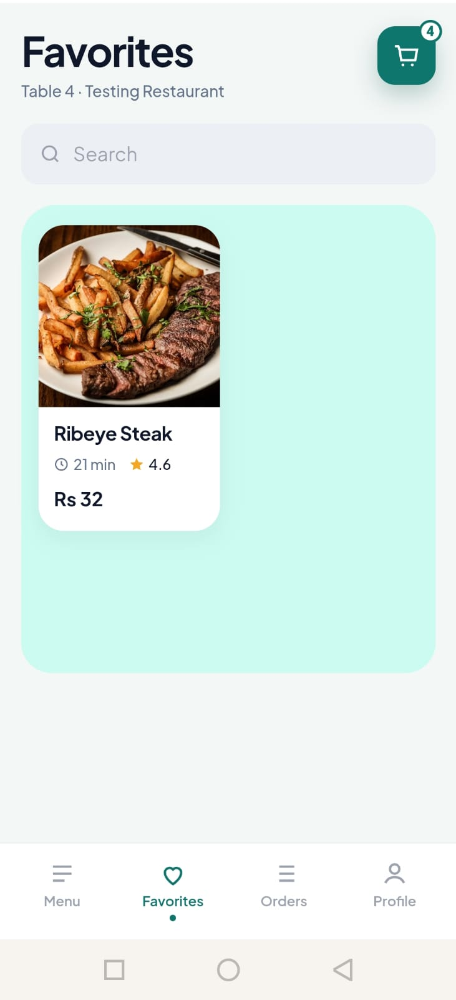 | 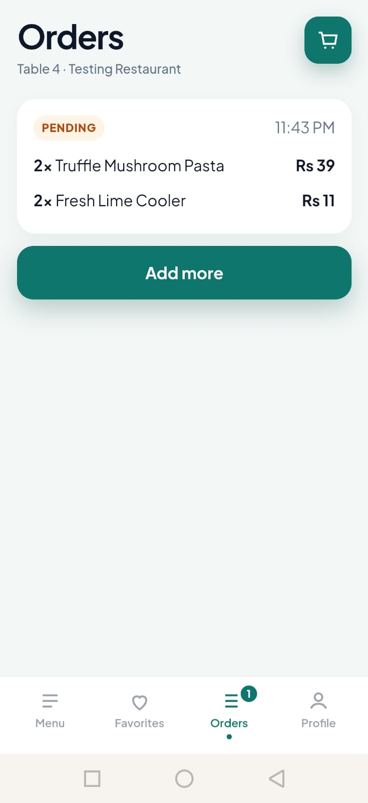 | 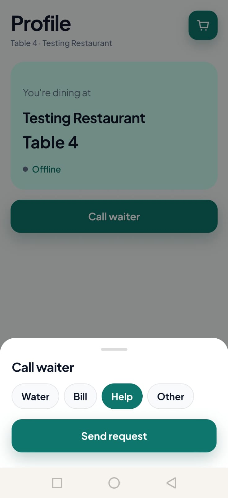 |

## Architecture

```text
Internet → ngrok → localhost:3080 → Nginx
                                  ├─ /           → Vue SPA
                                  ├─ /api/       → Flask + Gunicorn (eventlet)
                                  └─ /socket.io/ → Flask-SocketIO (+ Redis queue)
                                                    ├─ PostgreSQL
                                                    ├─ Redis
                                                    └─ MinIO (menu images)
```

### Surfaces (one SPA)

| Route | Role | Purpose |
| --- | --- | --- |
| `/admin/*` | manager | Floor map, live orders, menu, stations, QR export, settings |
| `/kitchen` | kitchen or manager | KDS lanes with timers, bump buttons, station filter, sound |
| `/menu?t=<token>` | guest | Menu, cart, Your Orders, waiter call with reasons |

### Order lifecycle (unchanged)

```text
Guest submits cart → pending
Kitchen Start      → preparing
Kitchen Ready      → ready
Kitchen Served     → served   (table free when no open tickets remain)
Any open step      → cancelled
```

Optimistic concurrency: status updates send `version`; stale updates return `409`.
Every transition is written to `order_status_audits`.

## Quick start

1. Copy env:

```bash
cp .env.example .env
```

`PUBLIC_BASE_URL` can stay **empty**. QR export auto-detects the live ngrok tunnel via `http://host.docker.internal:4040`.

2. Start stack:

```bash
docker compose up --build
```

3. Tunnel port 3080 (keep this running):

```bash
ngrok http 3080
```

No need to paste the ngrok URL into `.env` or recreate the backend when the subdomain changes — open **QR Codes** in Admin and download again.

4. Open the app → **Register** → build layout → export QRs → create kitchen staff in **Settings**.

## Auth

- Staff roles: `manager` | `kitchen`
- Login returns a **JWT access token** (Bearer) + **httpOnly refresh cookie**
- Guests use opaque QR `access_token`; sockets require a short-lived **guest_ticket** from `/api/public/session`
- Staff sockets join with the access JWT (`join_session`)

## Key URLs

- Admin: `/login` → `/admin` (sidebar: Floor, Live Orders, Menu, Stations, QR Codes, Settings)
- Kitchen: `/kitchen`
- Guest QR: `/menu?t=<opaque-table-token>`
- Health: `/api/health`
- Public config (currency PKR, language): `/api/public/config`
- MinIO console: `http://localhost:9001` (default minioadmin/minioadmin)
- Adminer: `http://localhost:8090`

## Features

- Multi-floor layouts with snap-to-close boundary editor and live occupancy
- Menu CRUD with modifiers, soft-delete, image URL or MinIO upload
- Kitchen stations + KDS filter
- QR PDF: 1 / 2 / 4 per A4; per-table reprint; optional token rotate
- Waiter call reasons: water / bill / help / other
- Theme toggle (light/dark) in Settings
- Payment adapter stub (`PAYMENTS_ENABLED=0`) ready for a gateway later

## Secrets

All secrets live in `.env` (see `.env.example`). Do not commit real production passwords.
